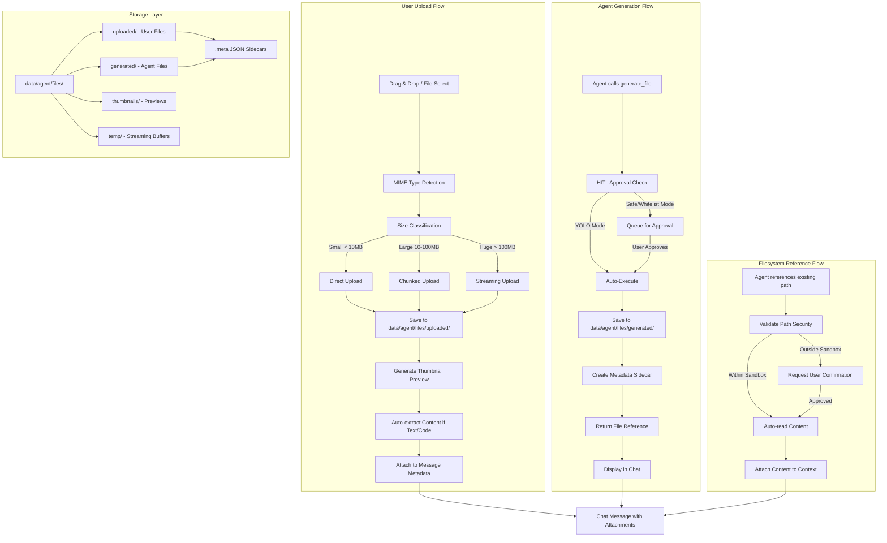

# Agent File Handling System - Architecture & Implementation Plan

## Overview

Comprehensive file handling system for the RustService agent interface supporting heterogeneous file types with dual upload modalities and bidirectional file flow.

## Architecture Diagram



## File Type Categories

| Category | MIME Types | Handling Strategy |
|----------|------------|-------------------|
| **Text/Code** | text/*, application/json, application/xml, application/javascript | Full content extraction, syntax highlighting |
| **Documents** | application/pdf, application/msword, application/vnd.* | Metadata extraction, thumbnail generation |
| **Images** | image/* | Thumbnail generation, base64 preview, EXIF extraction |
| **Media** | audio/*, video/* | Metadata only, streaming playback link |
| **Binaries** | application/octet-stream, application/x-* | Hash/checksum, size validation |

## Size Tiers & Handling

| Tier | Size Range | Upload Strategy | Processing |
|------|------------|-----------------|------------|
| **Small** | < 10MB | Direct base64 transfer | Immediate processing |
| **Large** | 10MB - 100MB | Chunked upload (1MB chunks) | Background processing |
| **Huge** | > 100MB | Streaming with progress | On-demand access only |

## TypeScript Type Definitions

### File Attachment (Unified Schema)

```typescript
interface FileAttachment {
  // Core Identity
  id: string;                    // UUID v4
  source: 'upload' | 'generated' | 'filesystem';
  
  // File Information
  originalName: string;        // Original filename
  storedName: string;          // UUID-based stored filename
  mimeType: string;            // Detected MIME type
  category: FileCategory;      // text | document | image | media | binary
  size: number;                // Bytes
  
  // Storage Paths
  storedPath: string;          // Relative to data/agent/files/
  thumbnailPath?: string;      // Preview thumbnail path
  
  // Content (for text/code files)
  content?: string;            // Extracted text content
  encoding?: string;           // Content encoding
  lineCount?: number;          // For code files
  
  // Metadata
  checksum: string;            // SHA-256 hash
  uploadedAt: string;          // ISO 8601 timestamp
  expiresAt?: string;          // Optional expiration
  
  // Source-specific metadata
  uploadMetadata?: UploadMetadata;
  generationMetadata?: GenerationMetadata;
  filesystemMetadata?: FilesystemMetadata;
}

type FileCategory = 'text' | 'code' | 'document' | 'image' | 'media' | 'binary';

interface UploadMetadata {
  uploadedBy: 'user';
  originalPath?: string;       // Original filesystem path if known
  autoExtracted: boolean;      // Whether content was auto-extracted
}

interface GenerationMetadata {
  generatedBy: 'agent';
  description: string;         // Agent's description of the file
  toolCallId: string;        // Reference to generating tool call
  approved: boolean;         // Whether HITL approval was obtained
}

interface FilesystemMetadata {
  originalPath: string;        // Original absolute path
  accessedAt: string;          // When agent first referenced it
  autoRead: boolean;          // Whether content was auto-read
}
```

### File Upload State

```typescript
interface FileUploadState {
  file: File;                  // Browser File object
  id: string;                  // Temporary upload ID
  status: 'pending' | 'uploading' | 'processing' | 'complete' | 'error';
  progress: number;            // 0-100
  bytesUploaded: number;
  totalBytes: number;
  error?: string;
  attachment?: FileAttachment;  // Final attachment when complete
}
```

### Activity Types

```typescript
// New activity type for file generation
type ActivityType = 
  | 'analyzed_directory'
  | 'searched'
  | 'analyzed_file'
  | 'ran_command'
  | 'read_file'
  | 'write_file'
  | 'move_file'
  | 'copy_file'
  | 'list_dir'
  | 'web_search'
  | 'get_system_info'
  | 'mcp_tool'
  | 'generate_file'      // NEW
  | 'attach_files';      // NEW

interface GenerateFileActivity extends BaseActivity {
  type: 'generate_file';
  filename: string;
  description: string;
  mimeType: string;
  size: number;
  path: string;
}

interface AttachFilesActivity extends BaseActivity {
  type: 'attach_files';
  fileCount: number;
  files: Array<{
    name: string;
    size: number;
    mimeType: string;
  }>;
}
```

## Rust Type Definitions

```rust
// src-tauri/src/types/agent.rs additions

/// File category for organizing and handling files
#[derive(Debug, Clone, Serialize, Deserialize, PartialEq)]
#[serde(rename_all = "lowercase")]
pub enum FileCategory {
    Text,
    Code,
    Document,
    Image,
    Media,
    Binary,
}

/// Source of a file attachment
#[derive(Debug, Clone, Serialize, Deserialize, PartialEq)]
#[serde(rename_all = "lowercase")]
pub enum FileSource {
    Upload,      // User uploaded
    Generated,   // Agent generated
    Filesystem,  // Referenced from filesystem
}

/// Unified file attachment metadata
#[derive(Debug, Clone, Serialize, Deserialize)]
#[serde(rename_all = "camelCase")]
pub struct FileAttachment {
    pub id: String,
    pub source: FileSource,
    pub original_name: String,
    pub stored_name: String,
    pub mime_type: String,
    pub category: FileCategory,
    pub size: u64,
    pub stored_path: String,
    pub thumbnail_path: Option<String>,
    pub content: Option<String>,
    pub encoding: Option<String>,
    pub line_count: Option<u32>,
    pub checksum: String,
    pub uploaded_at: String,
    pub expires_at: Option<String>,
    pub metadata: serde_json::Value,
}

/// File upload request from frontend
#[derive(Debug, Clone, Deserialize)]
#[serde(rename_all = "camelCase")]
pub struct FileUploadRequest {
    pub file_name: String,
    pub mime_type: String,
    pub size: u64,
    pub content_base64: String,  // For small files
    pub chunk_index: Option<u32>,
    pub total_chunks: Option<u32>,
}

/// File generation request from agent
#[derive(Debug, Clone, Deserialize)]
#[serde(rename_all = "snake_case")]
pub struct FileGenerationRequest {
    pub filename: String,
    pub content: String,
    pub description: String,
    pub mime_type: Option<String>,
}

/// Chunk upload status for large files
#[derive(Debug, Clone, Serialize)]
#[serde(rename_all = "camelCase")]
pub struct ChunkUploadStatus {
    pub upload_id: String,
    pub chunks_received: Vec<u32>,
    pub chunks_total: u32,
    pub bytes_received: u64,
    pub bytes_total: u64,
    pub complete: bool,
}
```

## Tauri Commands

| Command | Parameters | Returns | Description |
|---------|------------|---------|-------------|
| `save_uploaded_file` | `request: FileUploadRequest` | `FileAttachment` | Save uploaded file with metadata |
| `upload_file_chunk` | `upload_id: String, chunk_index: u32, content_base64: String` | `ChunkUploadStatus` | Upload chunk for large files |
| `finalize_chunked_upload` | `upload_id: String` | `FileAttachment` | Complete chunked upload |
| `generate_agent_file` | `request: FileGenerationRequest` | `FileAttachment` | Save agent-generated file |
| `read_file_content` | `file_id: String, max_bytes?: u64` | `String` | Read file content (text) |
| `read_file_binary` | `file_id: String` | `String` (base64) | Read binary file as base64 |
| `get_file_info` | `file_id: String` | `FileAttachment` | Get file metadata |
| `list_agent_files` | `source?: FileSource, limit?: u32` | `Vec<FileAttachment>` | List files |
| `delete_agent_file` | `file_id: String` | `()` | Delete file and metadata |
| `create_file_thumbnail` | `file_id: String` | `String` (path) | Generate thumbnail |
| `validate_filesystem_path` | `path: String` | `PathValidationResult` | Check path security |
| `read_filesystem_file` | `path: String, auto_extract?: bool` | `FileAttachment` | Read external file |

## React Components

### FileUploadZone
```typescript
interface FileUploadZoneProps {
  onFilesUploaded: (attachments: FileAttachment[]) => void;
  maxFiles?: number;
  maxTotalSize?: number;  // bytes
  allowedCategories?: FileCategory[];
  enableChunking?: boolean;
  chunkSize?: number;  // bytes, default 1MB
}
```

### FileAttachmentList
```typescript
interface FileAttachmentListProps {
  attachments: FileAttachment[];
  onRemove?: (id: string) => void;
  onPreview?: (id: string) => void;
  readOnly?: boolean;
  showContent?: boolean;  // For text/code files
}
```

### FilePreview
```typescript
interface FilePreviewProps {
  attachment: FileAttachment;
  maxPreviewSize?: number;  // For text files
  enableDownload?: boolean;
}
```

### ChatMessage (Updated)
- Render file attachments below message content
- Show thumbnails for images
- Show content preview for text/code
- Show download/open actions

### AgentActivityItem (Updated)
- Add `generate_file` activity rendering
- Show file icon, name, size
- Download button for generated files

## Agent Tools

### generate_file (HITL Tool)
```typescript
const generateFileTool = tool({
  description: `Generate a file with content. Creates the file in the agent workspace.
Use this when you need to create reports, logs, scripts, or any file output.
The user will see and can download the generated file.`,
  inputSchema: z.object({
    filename: z.string().describe('Name for the file including extension'),
    content: z.string().describe('Full content to write to the file'),
    description: z.string().describe('Brief description of what this file contains'),
    mime_type: z.string().optional().describe('MIME type (auto-detected if not provided)'),
  }),
  outputSchema: z.object({
    status: z.enum(['success', 'error', 'pending']),
    file_id: z.string().optional(),
    path: z.string().optional(),
    error: z.string().optional(),
  }),
});
```

### attach_files (Client Tool)
```typescript
const attachFilesTool = tool({
  description: `Attach files from the filesystem to the conversation.
Use this when the user references files they want you to analyze.`,
  inputSchema: z.object({
    paths: z.array(z.string()).describe('Absolute paths to files'),
    auto_extract: z.boolean().optional().describe('Automatically extract text content'),
  }),
  outputSchema: z.object({
    status: z.enum(['success', 'error', 'partial']),
    attachments: z.array(z.object({
      id: z.string(),
      name: z.string(),
      size: z.number(),
      content_preview: z.string().optional(),
    })),
    errors: z.array(z.string()).optional(),
  }),
});
```

## Security Considerations

1. **Path Validation**: All filesystem paths validated against sandbox escape attempts
2. **Size Limits**: Enforced at upload and generation time
3. **MIME Type Verification**: Magic number detection, not just extension
4. **Content Sanitization**: HTML/JS files served with proper content-type
5. **Checksum Verification**: SHA-256 for integrity
6. **Expiration**: Auto-cleanup of temp files after 30 days

## Storage Structure

```
data/agent/files/
├── uploaded/           # User-uploaded files
│   ├── <uuid>.bin      # File content
│   ├── <uuid>.meta     # JSON metadata
│   └── ...
├── generated/          # Agent-generated files
│   ├── <uuid>.bin
│   ├── <uuid>.meta
│   └── ...
├── thumbnails/         # Generated previews
│   ├── <uuid>.png
│   └── ...
└── temp/              # Chunked upload buffers
    └── <upload_id>/
        ├── chunk_0
        ├── chunk_1
        └── manifest.json
```

## Implementation Phases

### Phase 1: Core Types & Basic Upload
- TypeScript and Rust type definitions
- Simple file upload (small files only)
- Basic attachment display

### Phase 2: Agent File Generation
- generate_file tool
- HITL integration
- Generated file display

### Phase 3: Enhanced Features
- Chunked upload for large files
- Thumbnail generation
- Content auto-extraction

### Phase 4: Advanced Features
- Streaming for huge files
- Filesystem reference support
- Content search/indexing

## Integration Points

1. **AgentPage.tsx**: Add file upload zone to input area
2. **ChatMessage.tsx**: Render file attachments
3. **AgentActivityItem.tsx**: Handle generate_file activities
4. **agent-tools.ts**: Add generate_file and attach_files tools
5. **agent-chat.ts**: Include file context in messages
6. **lib.rs**: Register new Tauri commands

## Testing Checklist

- [ ] Upload small text file (< 1MB)
- [ ] Upload large file (> 10MB)
- [ ] Upload image with thumbnail
- [ ] Agent generates text file
- [ ] Agent generates code file
- [ ] HITL approval for file generation
- [ ] YOLO mode auto-generation
- [ ] File content auto-extraction
- [ ] Filesystem path reference
- [ ] File download from chat
- [ ] File deletion/cleanup
- [ ] MIME type validation
- [ ] Size limit enforcement
